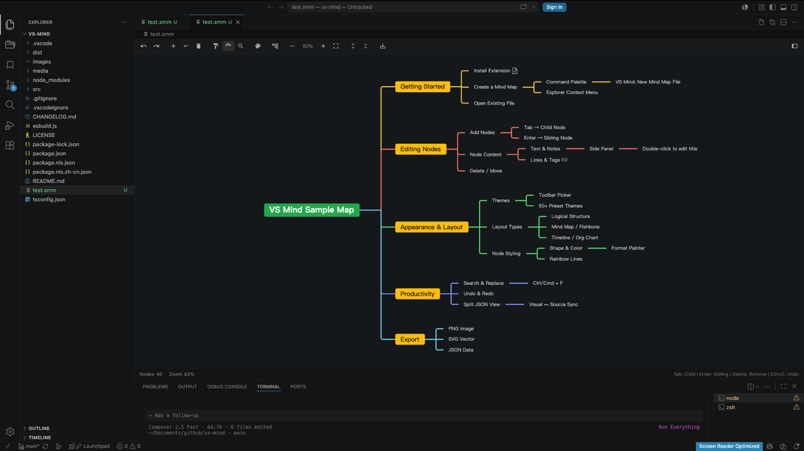

# VS Mind

**Visual mind map editor for VS Code** — drag nodes, edit inline, and work with mind maps using an experience that feels built into the editor.

[中文说明](#中文说明)

[](https://marketplace.visualstudio.com/items?itemName=rainlin.vs-mind)
[](LICENSE)



## Why VS Mind?

- **Feels native to VS Code** — opens like any other editor tab, with toolbar, command palette, keybindings, split view, and settings
- **Drag & drop editing** — drag nodes to rearrange, pan and zoom the canvas, double-click to edit text in place
- **Full visual editing** — add, delete, and style nodes from the canvas, side panel, or context menu
- **Plain JSON files** — human-readable map data, easy to edit and share
- **Rich appearance** — 50+ themes, multiple layouts, export, search, format painter
- **Bilingual UI** — English and Simplified Chinese

## Install

**From Marketplace**

1. Open VS Code / Cursor
2. Extensions → search **VS Mind**
3. Install [`rainlin.vs-mind`](https://marketplace.visualstudio.com/items?itemName=rainlin.vs-mind)

**From VSIX**

```bash
code --install-extension vs-mind-1.0.2.vsix
```

## Quick Start

1. Command Palette (`Ctrl+Shift+P` / `Cmd+Shift+P`) → **VS Mind: New Mind Map File**
2. Or open an existing mind map file from the explorer
3. Click the split icon in the editor title bar to open JSON source beside the canvas

## Features

| Category | Highlights |
| --- | --- |
| **Editing** | Drag nodes to reorder, inline text edit, add/delete nodes, expand/collapse, undo/redo |
| **Canvas** | Pan and zoom, fit to view, rainbow lines, line width |
| **Layouts** | Logical structure, mind map, org chart, catalog, timeline, fishbone |
| **Productivity** | Search & replace, format painter, rich node notes/links/tags |
| **Export** | PNG, SVG, JSON |
| **Integration** | Split JSON view, VS Code dark/light UI |

## File Format

Mind maps are saved as **JSON text files**.

```json
{
  "layout": "logicalStructure",
  "root": { "data": { "text": "Topic" }, "children": [] },
  "theme": { "template": "default", "config": {} }
}
```

## Keyboard Shortcuts

| Shortcut | Action |
| --- | --- |
| `Tab` | Add child node |
| `Enter` | Add sibling node |
| `Delete` | Delete node |
| `Ctrl+Z` / `Cmd+Z` | Undo |
| `Ctrl+F` / `Cmd+F` | Search |
| `Ctrl+Shift+E` / `Cmd+Shift+E` | Export PNG |

## Commands

All commands are available via the Command Palette:

| Command | Description |
| --- | --- |
| `VS Mind: New Mind Map File` | Create a new mind map |
| `VS Mind: Open Source` | Open JSON source beside the editor |
| `VS Mind: Open Mind Map Beside` | Open visual editor from JSON tab |
| `VS Mind: Export as PNG / SVG / JSON` | Export the current map |
| `VS Mind: Fit Canvas` | Fit content to viewport |
| `VS Mind: Zoom In / Zoom Out` | Adjust zoom level |
| `VS Mind: Expand All Nodes` / `Collapse All Nodes` | Toggle tree expansion |
| `VS Mind: Search` | Find and replace in nodes |

## Settings

| Setting | Default | Description |
| --- | --- | --- |
| `mindMap.displayLanguage` | `auto` | UI language: auto, `en`, or `zh-cn` |
| `mindMap.defaultLayout` | `logicalStructure` | Default layout for new maps |
| `mindMap.defaultTheme` | `default` | Default theme for new maps |
| `mindMap.autoFit` | `true` | Automatically fit canvas when opening a mind map |

## Development

```bash
npm install
npm run build
npm run watch      # rebuild on change
npm run package    # create .vsix
npm run publish    # publish to Marketplace (requires vsce login)
```

## Links

- [GitHub Repository](https://github.com/Rainlin007/vs-mind)
- [Report Issues](https://github.com/Rainlin007/vs-mind/issues)
- [VS Code Marketplace](https://marketplace.visualstudio.com/items?itemName=rainlin.vs-mind)

## Acknowledgments

VS Mind is built on top of the excellent open-source [simple-mind-map](https://github.com/wanglin2/mind-map) library.

## License

MIT

---

## 中文说明

[English](#vs-mind)

**VS Mind** 是在 VS Code 中可视化编辑思维导图的扩展 — 支持拖拽节点、就地编辑，整体交互接近原生编辑器体验。

### 亮点

- **接近原生 VS Code 体验** — 像普通文件一样在编辑器标签页中打开，支持工具栏、命令面板、快捷键、分屏与设置项
- **拖拽编辑** — 拖动节点调整结构，拖动画布平移缩放，双击就地修改文字
- **完整可视化编辑** — 在画布、侧栏、右键菜单中增删节点并调整样式
- **JSON 存储** — 导图内容以 JSON 保存，结构清晰
- **50+ 主题** — 工具栏/右键切换主题，支持彩虹线与连线粗细
- **双语界面** — 英语 / 简体中文

### 安装

在扩展市场搜索 **VS Mind**，或安装 [`rainlin.vs-mind`](https://marketplace.visualstudio.com/items?itemName=rainlin.vs-mind)。

### 快速开始

1. 命令面板 → **VS Mind: 新建思维导图**
2. 或在资源管理器中打开已有思维导图文件
3. 点击标题栏分屏图标，在侧边查看 JSON 源码

### 快捷键

| 快捷键 | 操作 |
| --- | --- |
| `Tab` | 添加子节点 |
| `Enter` | 添加同级节点 |
| `Delete` | 删除节点 |
| `Ctrl+Z` / `Cmd+Z` | 撤销 |
| `Ctrl+F` / `Cmd+F` | 搜索 |
| `Ctrl+Shift+E` / `Cmd+Shift+E` | 导出 PNG |

### 配置项

| 配置 | 默认值 | 说明 |
| --- | --- | --- |
| `mindMap.displayLanguage` | `auto` | 界面语言 |
| `mindMap.defaultLayout` | `logicalStructure` | 新建导图默认布局 |
| `mindMap.defaultTheme` | `default` | 新建导图默认主题 |
| `mindMap.autoFit` | `true` | 打开思维导图时自动适应画布 |

### 致谢

本扩展基于开源项目 [simple-mind-map](https://github.com/wanglin2/mind-map) 构建。

### 链接

- [GitHub 仓库](https://github.com/Rainlin007/vs-mind)
- [问题反馈](https://github.com/Rainlin007/vs-mind/issues)
- [VS Code 扩展市场](https://marketplace.visualstudio.com/items?itemName=rainlin.vs-mind)
